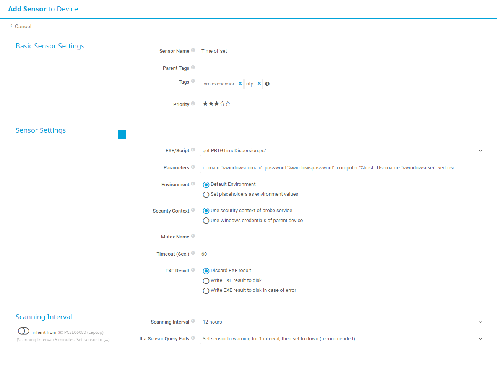

# Custom sensor to measure time diff between PRTG probe server and remote system

## Key command
```Powershell
Get-WmiObject -Class win32_localtime -ComputerName $Computername -Credential $Credential -ErrorAction Stop
```
Tested on target OS;
- XP
- WIndows 10 1903

## Powershell SYNOPSIS
```Powershell
.SYNOPSIS
    PRTG sensor 'EXE/Script adnvanced' measuring Time Dispersion between minitored device and PRTG server
.DESCRIPTION
    Get local time of probe server and compares of target system (device)
.EXAMPLE
    PS C:\> get-PRTGTimeDispersion.ps1 -domain '%windowsdomain' -password '%windowspassword' -computer '%host' -Username '%windowsuser'
    Returns XML readable by PRTG
.INPUTS
    Device parameters; %host, %windowsDomain, %windowsUser, %windowsPassword
.OUTPUTS
    XML output of;
        Timedifference in seconds
.PARAMETER Computername
    Target system IP or Hostname from PRTG placeholder %host
.PARAMETER Username
    Target system credential username from PRTG placeholder %windowsUser
.PARAMETER Domain
    Target system credential Domain from PRTG placeholder %windowsDomain
.PARAMETER Password
    Target system credential Password from PRTG placeholder %windowsPassword
.NOTES
    2020-01-10 Version 1 Klas.Pihl@Atea.se
```


## Output from sensor with -verbose

```Powershell
VERBOSE: Domain supplied: one, UserName: Domain\user
VERBOSE: Creating secure password string
VERBOSE: Creating credential for target system srv104.pihl.local
VERBOSE: Requesting target system local time
VERBOSE: Calculating time difference
VERBOSE: Creating XML formatted output
VERBOSE: Write formatted result to PRTG
```
```XML
<prtg>
    <result>
        <channel>TimeDifference</channel>
        <unit>TimeSeconds</unit>
        <showChart>1</showChart>
        <showTable>1</showTable>
        <float>1</float>
        <value>1</value>
    </result>
</prtg>
```

