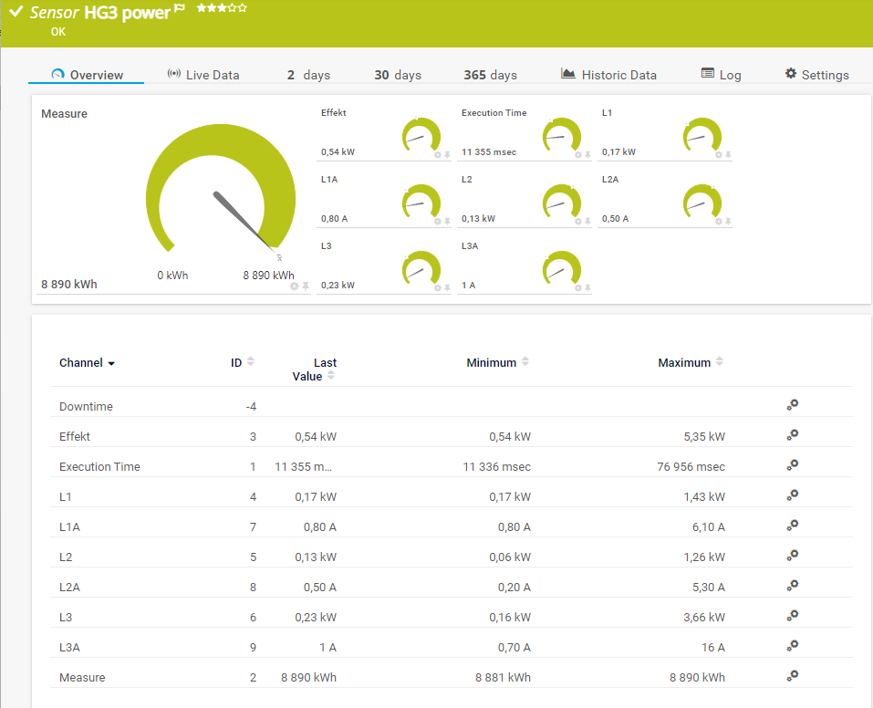

# PRTG sensor for power grid meeter

## Swedish implementation
P1 port from [DSMR P1 Companion Standard](https://www.netbeheernederland.nl/_upload/Files/Slimme_meter_15_a727fce1f1.pdf)

### Protocol
    SerialPort = '/dev/ttyUSB0'
    BaudRate=115200
    Parity=None
    StopBits=One
    DataBits = 8
    ByteSize = 8
    XonXoff = Off

## My soloution

Raspberry and arms length from whe power meeter.
[USB - P1](https://www.sossolutions.nl/slimme-meter-kabel-p1-kabel-3-meter)
Energy meeter Landis + Gyr E350

### PRTG
Trigger data collection, db and visualisation

### Shell script to start data collection by powershell


### Powershell code

Could not get .NET new-Object System.IO.Ports.SerialPort to get data so instead I used linux command CU
```bash
sudo apt-get install cu
cu -l /dev/ttyUSB0 -s 115200 -E%
```
Dumped output to a temporary file and parse the output and create json output readable in PRTG




### Bonus sensor
I like to have an easy metric to compare the total energy consumption day to day.
Wrote an 'XML Custom EXE/Script' sensor using PRTG API to collect historical data and use a factor to interpolate 24h consumption.