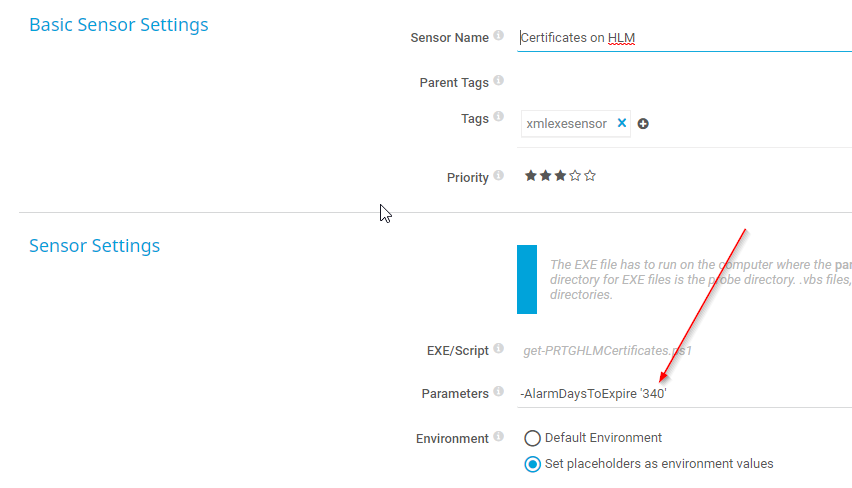

# PRTG Cusom XML sensor - get-PRTGHLMCertificates.ps1
Get all certificates under LocalMachine on the Device the sensor is deployed to
## Needed;
-	[PRTG](https://www.paessler.com/download/prtg-download)
-	Windows Host with Powershell 5.1+
 
## Result


## Instructions
Copy script to %ProgramFiles(x86)%"\PRTG Network Monitor\Custom Sensors\EXEXML on all probes and add a 'XML Custom EXE' sensor.
In sensor settings define parameter AlarmDaysToExpire (default value 14 days)
```
-AlarmDaysToExpire '14'
```
## Tested on
- PRTG version 20.1.55.1775
- Windows server 2016
- Windows server 2019
- Windows 10 1903


## Error handling
YES! 
Returns error in script as text and failes sensor. 

## Bugs
Channel unit dont fully work as hoped on all systems. 
[PRTG Bug](https://kb.paessler.com/en/topic/81744-customunit-not-recognized-in-json-exe-script-advanced)
Workaround is to change unit manually on channel(s)


