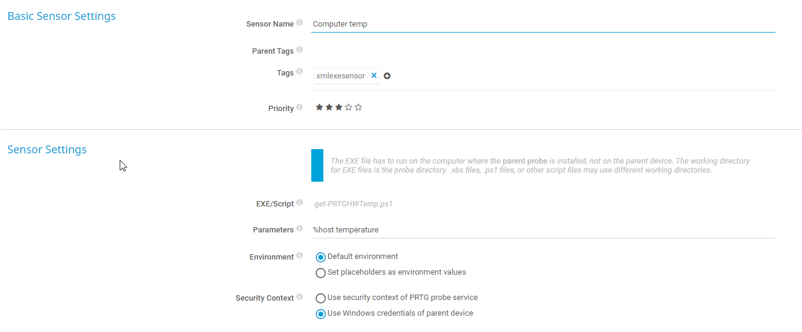
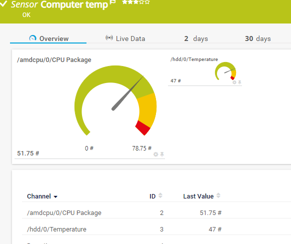

# Code to get temperature data from ~~OpenHardwareMonitor~~ Libre Hardware Monitor

## Update 2023
New laptop from work with new Intel CPU and chipset. 
Newer fork from Open Hardware Monitor called [Libre Hardware Monitor](https://github.com/LibreHardwareMonitor/LibreHardwareMonitor)

Updated PRTG sensor with added param to define CIM source.
Example; 
```powershell
. .\get-PRTGHWmetric.ps1 -Computer laptop.pihl.local -Sensortype power -Source librehardwaremonitor
```
### Installation
[Choco](https://community.chocolatey.org/) package;
```powershell
choco install choco install librehardwaremonitor
```

## Background
Asus Ryzen alternative to Intel NUC - PN50 with Ryzen 4700U is a bit loud.
[Akasa](http://www.akasa.co.uk/update.php?tpl=product/product.detail.tpl&type=Fanless%20Chassis&type_sub=Fanless%20NUC&model=A-NUC62-M1B) have an passive computer case that should manage TDP of the 4700U but better safe then sorry so of course - [monitor!](http://openhardwaremonitor.org/wordpress/wp-content/uploads/2011/04/OpenHardwareMonitor-WMI.pdf)

[OpenHardwareMonitor](https://openhardwaremonitor.org/)


## Setup & result



