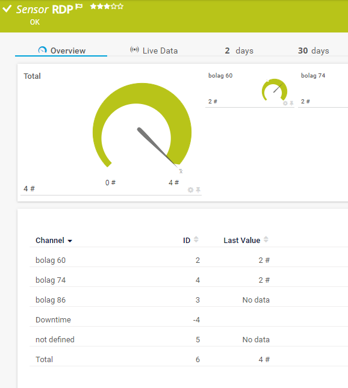
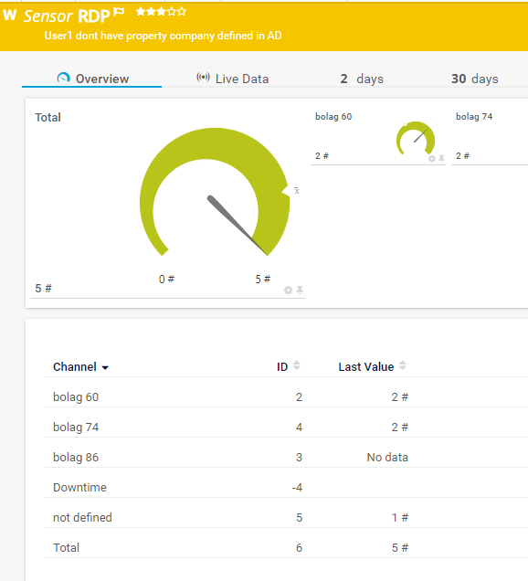

# PRTG sensor to count domain user accounts is multiple security groups and group them by attribute 'company'


## Result






```powershell
NAME
    \get-PRTGRDSusers.ps1

SYNOPSIS
    Search Active directory security groups (neasted/recursive) for users and return a list of unique users grouped by company
    Returns output in PRTG json format


SYNTAX
    \get-PRTGRDSusers.ps1 [[-GroupNameFilter] <Object>] [[-NotDefinedCompanyMessage] <Object>]
    [<CommonParameters>]


DESCRIPTION
    Returns error to PRTG if no users found or other error is found.
    Returns data with warning if a user does not have 'Company' attribute set.


PARAMETERS
    -GroupNameFilter <Object>
        Filter wildcard comparison.

        Required?                    false
        Position?                    1
        Default value                00R-*-RDS
        Accept pipeline input?       false
        Accept wildcard characters?  false

    -NotDefinedCompanyMessage <Object>
        Name to return on company if not found on user object.

        Required?                    false
        Position?                    2
        Default value                not defined
        Accept pipeline input?       false
        Accept wildcard characters?  false

    <CommonParameters>
        This cmdlet supports the common parameters: Verbose, Debug,
        ErrorAction, ErrorVariable, WarningAction, WarningVariable,
        OutBuffer, PipelineVariable, and OutVariable. For more information, see
        about_CommonParameters (https://go.microsoft.com/fwlink/?LinkID=113216).

INPUTS
    Active directory domain of PRTG probe


OUTPUTS
    PRTG JSON format
    https://manuals.paessler.com/custom_sensors.htm#advanced_sensors


NOTES


        2021-06-08 Verson 1 Klas.Pihl@Atea.se
            Developed as customer soulution

    -------------------------- EXAMPLE 1 --------------------------

    PS C:\>.\get-PRTGRDSusers.ps1 -Verbose
        Output json formatted file

```
```json
        {
        "prtg": {
            "result": [
            {
                "channel": "not defined",
                "value": 2,
                "warning": 1
            },
            {
                "channel": "bolag 60",
                "value": 1,
                "warning": 1
            },
            {
                "channel": "bolag 74",
                "value": 1,
                "warning": 1
            },
            {
                "channel": "Total",
                "value": 4.0,
                "warning": 1
            }
            ],
            "text": "User1 User4 dont have property company defined in AD"
        }
        }
```


