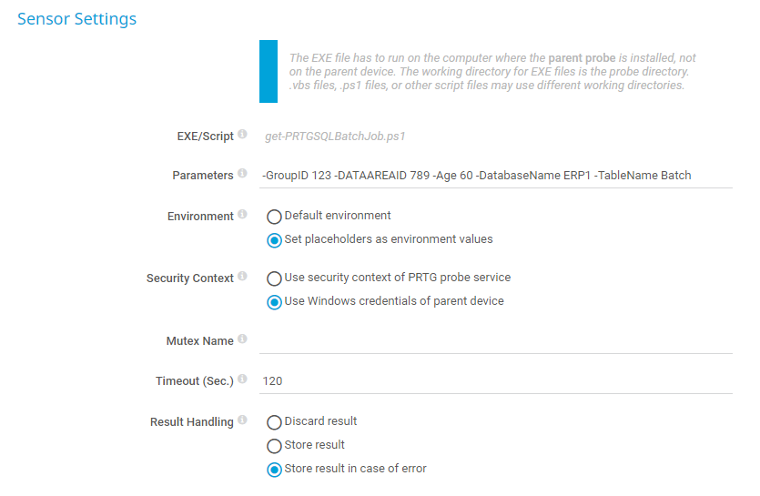

# get-PRTGSQLBatchJob

## Background
PRTG sensor [Microsoft SQL v2 Sensor](https://www.paessler.com/manuals/prtg/microsoft_sql_v2_sensor) can define one (1)
imput parameter.  

Customer monitor their business process environments by running batch jobs on multiple SQL instances. The PRTG sensor 'Microsoft SQL v2 Sensor' would render a massive amount of custom .sql files managed on multiple probe servers on '.\PRTG Network Monitor\Custom Sensors\sql\mssql' 

This custom sensor is reusable with the system specific configurations defined in sensor parameters. 

## ~~Alternative 1~~
Add split function in SQL query to get multiple variables from @prtg

## Alternative 2
Write a 'EXE/Script Advanced Sensor' sensor with use of [SQL Server Powershell](https://learn.microsoft.com/en-us/sql/powershell/sql-server-powershell?view=sql-server-ver16) commandlet. 

### Specials
The used SQLserver module only works with x64 and PRTG probe still uses x86 runtime on custom sensors the sensor restarts a new x64 powershell session and restart the sensor.

### Sensor settings


### Parameters
```powershell
-ServerInstance SQLServer1 -GroupID 123 -DATAAREAID 789 -Age 60 -DatabaseName ERP1 -TableName Batch
```
