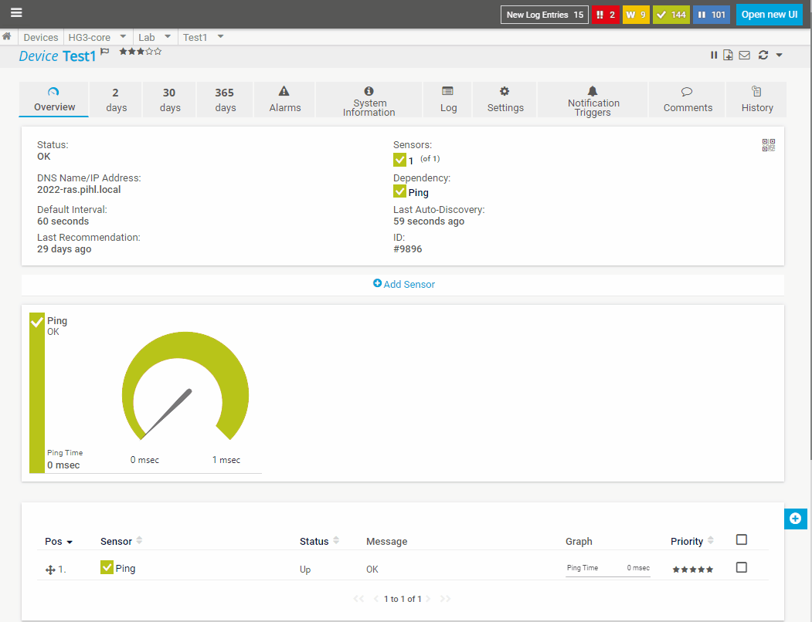

#  Validates windows services with startup as automatic w/wo delayed start as running.

```powershell
<#
.SYNOPSIS
    Validates windows services with startup as automatic w/wo delayed start as running.
.DESCRIPTION
    Creates 4 channels and set alert limits higher then 0/0,5 so any service not running is detcted.

    PRTG Sensor settings;
        Example;
        Parameters:         -Computer %host -exclude gpsvc,IntelAudioService,"Intel(R) TPM Provisioning Service"
        Security Context:   Use Windows credentials of parent device

        Sensor runs on probe server with Powershell 5.
        Recommended scanning Interval - 5+ minutes.


.NOTES
    2022-06-28 Version 1 Klas.Pihl@Atea.se
.LINK
    Rewrite of https://kb.paessler.com/en/topic/62319-how-do-i-monitor-all-services-on-a-server-set-to-automatic

.EXAMPLE
    .\get-PRTGServices.ps1 -Computer server1.pihl.local -UptimeGrace 7200 -Exclude IntelAudioService -Verbose

    Validates all service set as automatic* start is running within 7200 seconds after latest restart. IntelAudioService is excluded from validation.

.PARAMETER Computer
    Remote computer to query

.PARAMETER Exclude
    List of services to exclude from validation

.PARAMETER UptimeGrace
    Seconds to wait after a system startup/reboot for service to start that is set to automatic or automatic delayed start.
#>
```

## Example
