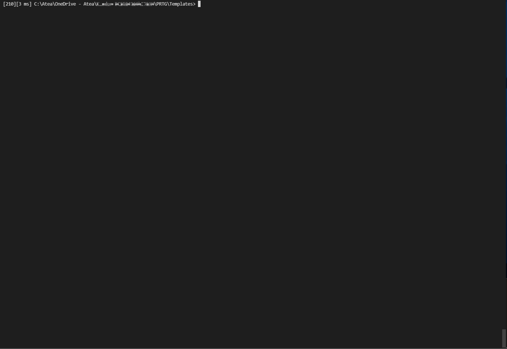

# Get sensors and intervals of PRTG templates

## Output



## Parameters

```powershell
-Path <Object>
    Path for devicetemplates

    Required?                    false
    Position?                    1
    Default value                C:\Program Files (x86)\PRTG Network Monitor\devicetemplates
    Accept pipeline input?       false
    Accept wildcard characters?  false


-Filter <Object>
    Template file name filter

    Required?                    false
    Position?                    2
    Default value                *.odt
    Accept pipeline input?       false
    Accept wildcard characters?  false
    ```