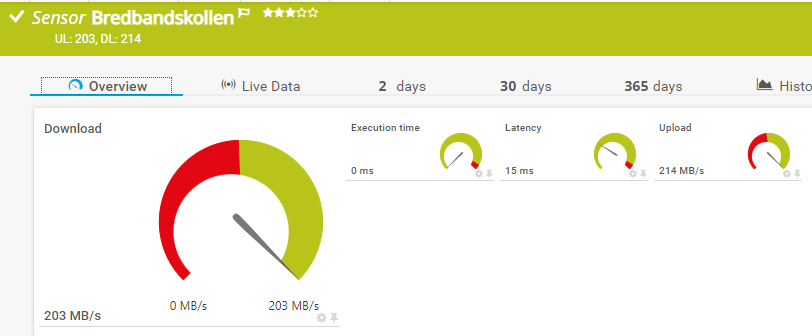

# Measure internet speed
Uses Swedish Internetstiftelsen Bredbandskollen

## Overview


## Help
```powershell
 get-help .\measure-bbk.ps1 -Full

NAME
    H:\Git\PRTG\measure-bbk\measure-bbk.ps1

SYNOPSIS
    Use WSL on Windows together with Bredbandskollens's binary to measure internet speed


SYNTAX
    H:\Git\PRTG\measure-bbk\measure-bbk.ps1 [[-Computer] <Object>] [[-Duration] <Object>] [[-Logfile] <Object>]
    [<CommonParameters>]


DESCRIPTION
    Use WSL on Windows together with Bredbandskollens's binary to measure internet speed
    Output 4 PRTG channels

    WSL and Linux distro must be accessable from the user session that is invoked by the custom sensor (PRTG Security context).   

    Environment use PRTG placeholders;
        $env:prtg_username,
        $env:prtg_password,
        $env:prtg_host


PARAMETERS
    -Computer <Object>

        Required?                    false
        Position?                    1
        Default value                $env:prtg_host
        Accept pipeline input?       false
        Accept wildcard characters?  false

    -Duration <Object>
        Duration in seconds to measure

        Required?                    false
        Position?                    2
        Default value                10
        Accept pipeline input?       false
        Accept wildcard characters?  false

    -Logfile <Object>
        Output file to write to. If not specified, a temporary file will be created and deleted after the script has run.

        Required?                    false
        Position?                    3
        Default value
        Accept pipeline input?       false
        Accept wildcard characters?  false

    <CommonParameters>
        This cmdlet supports the common parameters: Verbose, Debug,
        ErrorAction, ErrorVariable, WarningAction, WarningVariable,
        OutBuffer, PipelineVariable, and OutVariable. For more information, see
        about_CommonParameters (https://go.microsoft.com/fwlink/?LinkID=113216).

INPUTS

OUTPUTS
    PRTG output
    {
    "prtg": {
        "result": [
        {
            "Channel": "Download",
            "Float": 0,
            "Value": 135,
            "LimitMode": 1,
            "LimitMinError": "100",
            "CustomUnit": "MB/s"
        },
        {
            "Channel": "Upload",
            "Float": 0,
            "Value": 138,
            "LimitMode": 1,
            "LimitMinError": "100",
            "CustomUnit": "MB/s"
        },
        {
            "Channel": "Execution time",
            "Float": 0,
            "Value": 4934,
            "CustomUnit": "ms",
            "LimitMode": 1,
            "LimitMaxError": 15000
        },
        {
            "Channel": "Latency",
            "Float": 0,
            "Value": 15,
            "CustomUnit": "ms",
            "LimitMode": 1,
            "LimitMaxError": 50
        }
        ],
        "text": "UL: 135, DL: 138"
    }
    }


NOTES


        2023-04-11 Version 1 Klas.Pihl@gmail.com

    -------------------------- EXAMPLE 1 --------------------------

    PS > . .\measure-bbk.ps1 -Duration 2 -Logfile "c:\temp\bbk.log" -Verbose


RELATED LINKS
    https://www.bredbandskollen.se/om/mer-om-bbk/bredbandskollen-cli/
```